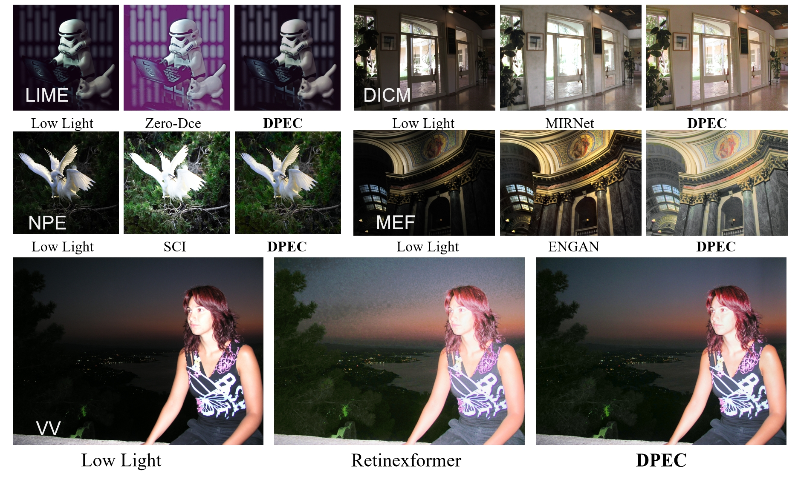
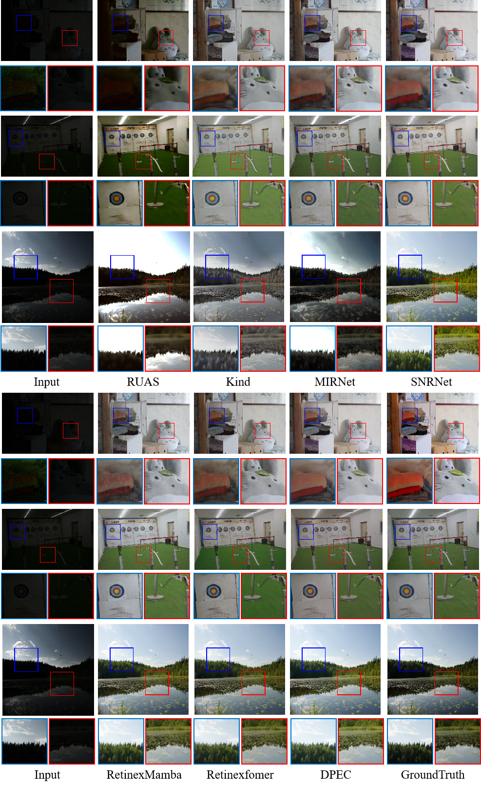

## Introduction
The code implementation of DPEC is provided here. As a low-light image enhancement algorithm based on VMamba architecture, DPEC only needs to use a small amount of computing resources to achieve good image enhancement. If you find this repo useful, please give it a star ⭐ and consider citing our paper in your research. Thank you.


## Results
- Results on LOL-v1, LOL-v2-real, LOL-v2-synthetic,and LSRW datasets can be downloaded from [Baidu Disk](https://pan.baidu.com/s/1fDHPUuLadmdnZPSJhx_upg) (code: `VMLL`)


&nbsp;


## 1. Create Environment
### 1.1 Install the environment with Pytorch 2.1
- Make Conda Environment
```
conda create -n VMLL python=3.10
conda activate VMLL
```
- Install Dependencies
```
pip install torch==2.1.2 torchvision==0.16.2 torchaudio==2.1.2 --index-url https://download.pytorch.org/whl/cu121

pip install matplotlib scikit-learn scikit-image opencv-python yacs joblib natsort h5py tqdm tensorboard mamba_ssm

pip install einops gdown addict future lmdb numpy pyyaml requests scipy yapf timm
```

&nbsp;    


## 2. Prepare Dataset
We present here the expanded LOL series dataset we used, as well as the original LSRW dataset.

LOL-v1 [Baidu Disk](https://pan.baidu.com/s/1f9vKmsoHkK33iztV_cdbEQ?pwd=VMLL) (code: `VMLL`)

LOL-v2 [Baidu Disk](https://pan.baidu.com/s/1AUXs0tVtnyo7S1LEQ-G2mA?pwd=VMLL) (code: `VMLL`)

LSRW [Baidu Disk](https://pan.baidu.com/s/1I75Q5_pz7g4g00CNuSF-ZA?pwd=VMLL) (code: `VMLL`)

We also provide download links for LIME, NPE, MEF, DICM, and VV datasets that have no ground truth:[Google Drive](https://drive.google.com/drive/folders/0B_FjaR958nw_djVQanJqeEhUM1k?resourcekey=0-d8qXaDrCR39dHNoa4CJdUA)


&nbsp;      


## 3. Testing
Download our models from [Baidu Disk](https://pan.baidu.com/s/1Vn3Fv85YsmW6FPrxD19Wyg?pwd=VMLL) (code: `VMLL`). Put them in folder `pretrained_weights`
```shell
# activate the environment
conda activate VMLL

#LOLv1
python test.py --test_folder ./datasets/LOLv1_en/test/low --modelfile ./pretrained_weights/VMLL/LOLv1.pth

#LOLv2_real
python test.py --test_folder ./datasets/LOLv2_en/Real_captured/test/low --modelfile ./pretrained_weights/VMLL/LOLv2_real.pth

#LOLv2_syn
python test.py --test_folder ./datasets/LOLv2_en/Synthetic/test/low --modelfile ./pretrained_weights/VMLL/LOLv2_syn.pth

#LSRW
python test.py --test_folder ./datasets/LSRW/test/low --modelfile ./pretrained_weights/VMLL/LSRW.pth
```



&nbsp;


## 4. Training
The whole training process of VMLL is divided into two steps. The second step training needs to use the model obtained in the first step training, but the relevant pre-trained model of the first step is also provided here for use.The step2 Pretrain_weights [Baidu Disk](https://pan.baidu.com/s/1iqLBng-UZMXGJyWVF444uQ?pwd=VMLL) (code: `VMLL`)

The step1 :
```shell
#LOLv1
python train_step1.py --trainset ./datasets/LOLv1_en/train/ --testset ./datasets/LOLv1_en/test --modelname VMLL_LOLv1_pre

#LOLv2_real
python train_step1.py --trainset ./datasets/LOLv2_en/Real_captured/train/ --testset ./datasets/LOLv2_en/Real_captured/test --modelname VMLL_LOLv2r_pre

#LOLv2_syn
python train_step1.py --trainset ./datasets/LOLv2_en/Synthetic/train/ --testset ./datasets/LOLv2_en/Synthetic/test --modelname VMLL_LOLv2s_pre

#LSRW
python train_step1.py --trainset ./datasets/LSRW/train/ --testset ./datasets/LSRW/test --modelname VMLL_LSRW_pre
```

The step2(Here, the provided pre-training model is used as an example. If you need to use your own model weight obtained in the first step, replace the weights_path) :
```shell
#LOLv1
python train_step2.py --trainset ./datasets/LOLv1_en/train/ --testset ./datasets/LOLv1_en/test --modelname VMLL_LOLv1 --weights_path ./pretrained_weights/BEE/LOLv1.pth 

#LOLv2_real
python train_step2.py --trainset ./datasets/LOLv2_en/Real_captured/train/ --testset ./datasets/LOLv2_en/Real_captured/test --modelname VMLL_LOLv2r --weights_path ./pretrained_weights/BEE/LOLv2_real.pth 

#LOLv2_syn
python train_step2.py --trainset ./datasets/LOLv2_en/Synthetic/train/ --testset ./datasets/LOLv2_en/Synthetic/test --modelname VMLL_LOLv2s --weights_path ./pretrained_weights/BEE/LOLv2_syn.pth 

#LSRW
python train_step2.py --trainset ./datasets/LSRW/train/ --testset ./datasets/LSRW/test --modelname VMLL_LSRW --weights_path ./pretrained_weights/BEE/LSRW.pth 
```
